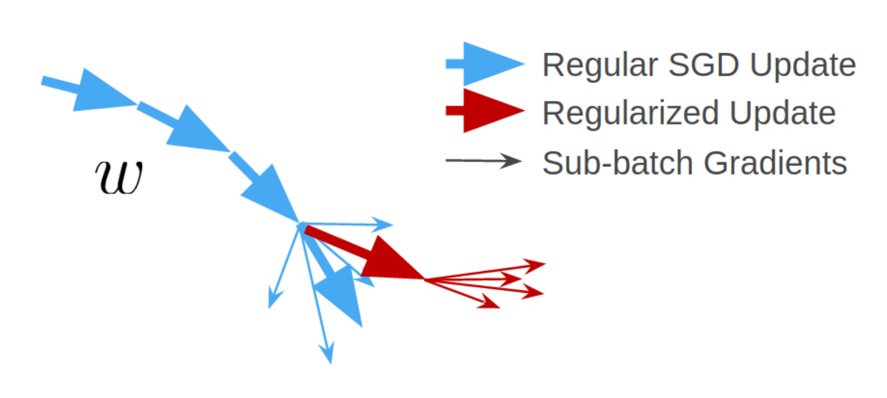

# Information-Theoretic Local Minima Characterization and Regularization

This repo contains an elegant TensorFlow 2 (re-)implementation of the method introduced in the paper:  
[**Information-Theoretic Local Minima Characterization and Regularization**](https://arxiv.org/pdf/1911.08192.pdf)  
[Zhiwei Jia](https://zjia.eng.ucsd.edu), [Hao Su](https://cseweb.ucsd.edu/~haosu/)  
ICML 2020




#### Abstract
Recent advances in deep learning theory have evoked the study of generalizability across different local minima of deep neural networks (DNNs). While current work focused on either discovering properties of good local minima or developing regularization techniques to induce good local minima, no approach exists that can tackle both problems. We achieve these two goals successfully in a unified manner. Specifically, based on the observed Fisher information we propose a metric both strongly indicative of generalizability of local minima and effectively applied as a practical regularizer. We provide theoretical analysis including a generalization bound and empirically demonstrate the success of our approach in both capturing and improving the generalizability of DNNs. Experiments are performed on CIFAR-10, CIFAR-100 and ImageNet for various network architectures.

#### Code
##### Dependencies (Python >=3.6 & pip)
```
numpy, tensorflow>=2.2, absl-py, tqdm
```
##### Examples
To run the regularized SGD (or the baseline) on Wide ResNet for CIAFR-10, execute
```bash
cd InfoMCR
python src/train_cifar10.py --model_id=$MODEL_NAME --use_local_min_reg=True
```
To evalute the proposed metric on models obtained with or without applying the regularizer, run
```bash
cd InfoMCR
python src/eval_cifar10.py --model_id=$MODEL_NAME
```
#### BibTex
